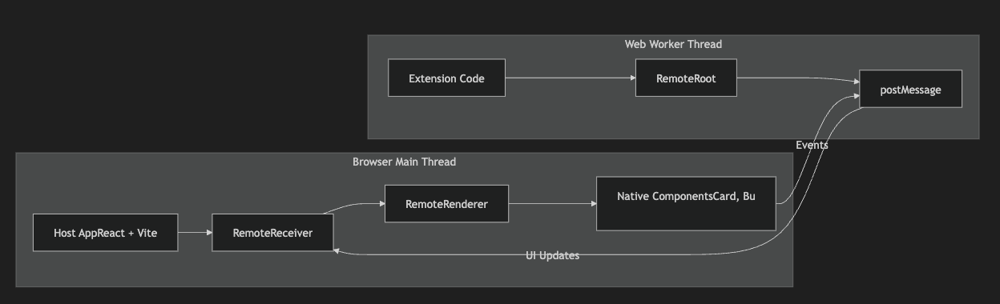

# Remote-UI Host and Extension Example

Create two isolated projects demonstrating remote-ui architecture for sandboxed UI rendering.

## User Review Required

> [!IMPORTANT]
> This example uses **Vite** (not Webpack) for simpler setup. The remote-ui web-workers package is designed for Webpack, so we'll use a **simplified approach with native web workers** that achieves the same isolation goals.

> [!WARNING]
> The extension runs in a Web Worker and **cannot access**: `window`, `document`, `localStorage`, `cookies`, or any DOM APIs. This is enforced by the browser's worker sandbox.

## Architecture Overview



## Setup

1. Clone this repository:
```bash
git clone https://github.com/remote-ui/remote-ui.git
```

2. Start the host app:
```bash
cd host-app
npm install
npm run dev
```

3. Start the extension app:
```bash
cd extension-app/dist
npx serve -p 3001 --cors
```

4. Open http://localhost:5173 in your browser to see the host app.
